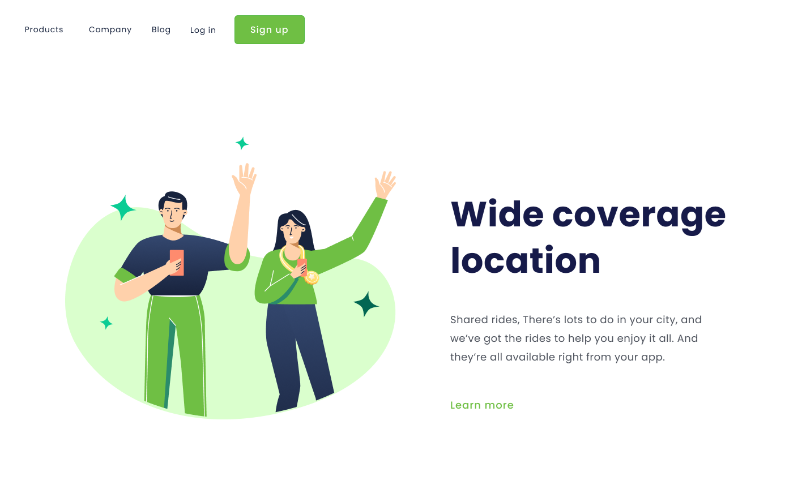

<h1 align="center">Wide Coverage Location</h1>
<h2>Projeto Sobre Responsividade</h2>

Projeto para aplicar o conceito de responsividade, com um site que se adapta automaticamente a dispositivos desktop e mobile.

Tecnologias utilizadas:

Visualização do projeto:

<h3>Desktop</h3>

 
<h3>Mobile</h3>

